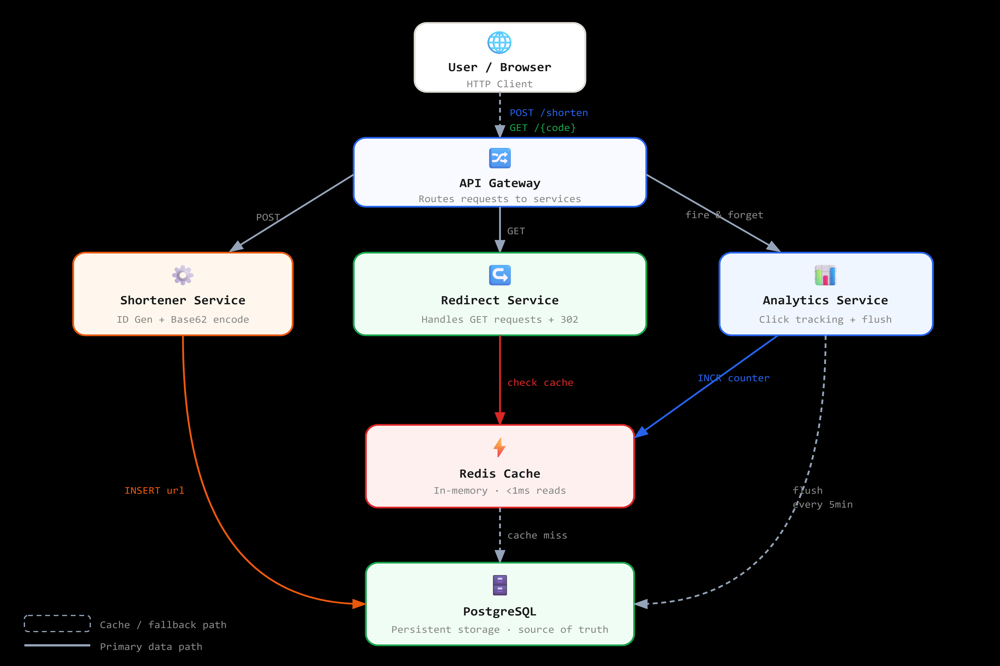

# URL Shortener

A secure and scalable URL Shortener application built using Node.js, Express, MongoDB, and React. This project supports both auto-generated short links and custom personalized URLs with proper validation and collision prevention.

---

## 🏗 System Architecture (v1.0)


---

## Features

- Secure short code generation using SHA-512 hashing and Base62 encoding
- Custom alias support with validation
- Duplicate prevention using unique database indexing
- Click tracking for each short URL
- RESTful API design
- URL validation and error handling
- Clean and modular project structure

---

## Tech Stack

### Backend

- Node.js
- Express.js
- MongoDB (Mongoose)
- Crypto (SHA-512)

### Frontend

- React
- Axios
- Chakra UI

---

## Project Structure

```
src/
 ├── controllers/
 ├── models/
 ├── routes/
 ├── utils/
 └── components/
```

---

## API Endpoints

### Create Short URL

**POST** `/api/url/shorten`

Request Body:

```json
{
  "longUrl": "https://example.com",
  "urlCode": "customAlias"
}
```

Response:

```json
{
  "shortUrl": "http://localhost:5000/abc123",
  "urlCode": "abc123"
}
```

---

### Redirect to Original URL

**GET** `/:code`

Redirects the user to the original long URL and increments the click counter.

---

## Environment Variables

```
PORT=5000
MONGO_URI=your_mongodb_connection_string
BASEURI=http://localhost:5000
```

---

## Installation

```
git clone <repository-url>
cd url-shortener
npm install
npm run dev
```

---

## Future Scope

- User authentication (JWT)
- Advanced analytics
- Expiry-based links
- Redis caching
- Rate limiting
- QR code generation
- Admin dashboard